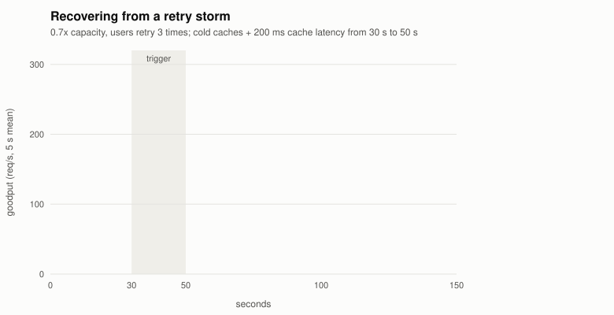
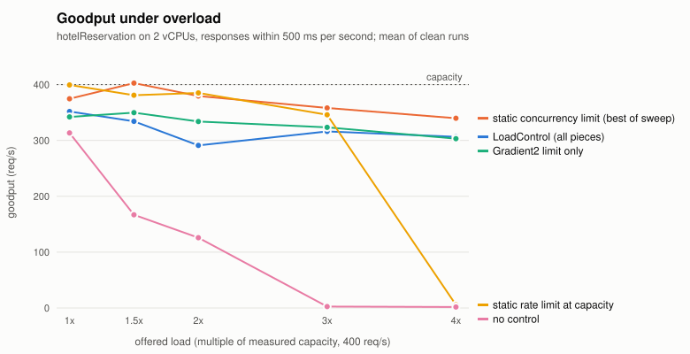
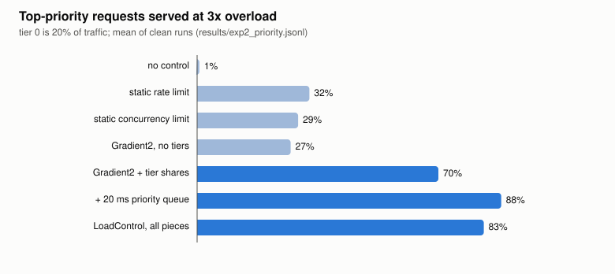
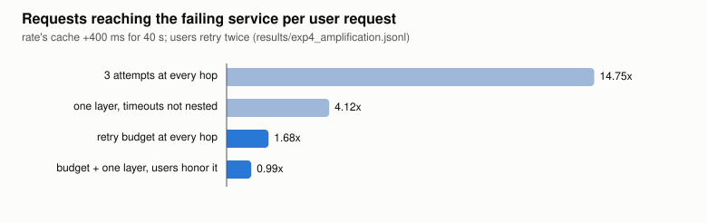

# LoadControl

LoadControl is overload control for Go microservices: gRPC-Go interceptors
and net/http middleware that keep a service doing useful work when it is sent
more than it can handle. It sheds low-priority work first, drops requests
whose deadline has already passed, adapts its concurrency limit from
latency, caps retries with a budget, and lets only one layer of a call chain
retry. It is measured on DeathStarBench hotelReservation, a public Go and
gRPC microservice benchmark, where it also reproduces a metastable failure
(a retry storm that keeps the system down after its cause is gone) and
recovers from it.

What it does not claim: every number comes from one 4-core mini PC, with the
benchmark's containers sharing a 2-vCPU VM with the load generator. That is
not a production mesh, and absolute throughput is small (about 400 req/s).
Every algorithm here is published (credits in [DESIGN.md](DESIGN.md)); the
work is the implementation, the combination, the benchmark patch, the failure
reproduction and the measurements. Every figure below is in
[NUMBERS.md](NUMBERS.md) with the run it came from, and the runs themselves
are in `results/*.jsonl` with the machine and its load recorded.

## Results

All on hotelReservation, whose measured no-control capacity on this machine
is **398 req/s** of goodput (2xx within 500 ms). Full tables, run counts and
caveats: [NUMBERS.md](NUMBERS.md).

**A metastable failure, reproduced and recovered from.** At 0.7x capacity
with users that retry three times, a 20-second trigger (cold caches plus
200 ms on the cache tier, or a CPU-hogging neighbour) pushes the system over.
Without control it **never comes back**: zero goodput for the remaining 80 to
95 s of every run, long after the trigger is gone, because retries alone keep
it overloaded (2 of 2 runs per trigger; naive per-hop retries the same). With
LoadControl it is back above 90% of normal goodput **within a second of the
trigger ending**. In 2 of 4 control runs the uncontrolled system fell into the
same state with no trigger at all.



**Goodput under overload.** At 3x capacity the uncontrolled system delivers
**2.6 req/s (0.6% of capacity)**. LoadControl holds **79% of capacity with
Gradient2** (p99 196 ms) or **96% with AIMD** (but p99 847 ms). A hand-tuned
static concurrency limit does about as well on goodput once tuned (358 req/s
at 32, 371 at 64), but 256 collapses to 191 and it serves the top tier no
better than chance; a static rate limit at measured capacity holds at 3x
(346 req/s, p99 897 ms) and collapses at 4x (5.5 req/s).



**Priority.** With 20% of traffic marked critical at 3x load, tier shares
plus a 20 ms priority queue serve **88% of critical requests at p99 179 ms**,
against 27 to 32% for no tiers, a static limit or a rate limit.



**Retry amplification.** When one dependency stalls, naive retries (3
attempts at every hop) send **14.75 requests to it per user request**. A
gRFC A6 retry budget at every hop cuts that to **1.68**; adding the one-layer
rule with clients that honor it gives **0.99**. The one-layer rule alone leaks
(4.1) when a caller's per-try timeout is shorter than the retries below it:
timeouts have to nest.



**What it costs.** Every piece on adds **18 us per call** in process (47.8 to
65.4 us over bufconn) and 42 us over loopback TCP; the admission path alone
is 0.6 us. Below capacity, the AIMD configuration shed **0 of 12,000**
requests at half load; the Gradient2 one shed 20 (0.17%), and up to 9.7% at
0.9x, which is the price of its lower latency.

**Things that did not work, measured.** The SRE client-side throttle on its
own does not protect the service in front of it (2.7 req/s at 3x) and, after
a load step, stayed shut for its 30 s memory while load was already back to
half. DAGOR driven by the Go scheduler's run-queue latency never fired here,
because on a shared VM the contention is between processes, which Go's
scheduler cannot see. Both are in [BUG_LOG.md](BUG_LOG.md) and
[DESIGN.md](DESIGN.md).

**On Kubernetes.** The same images, config and faults on a one-node k3d
cluster (on the same VM, so k3s itself takes some of the CPU): at 1,200 req/s
offered, no control delivers 0.4 req/s and LoadControl 209 req/s; under the
cache trigger the uncontrolled system never recovered (2 of 2) and LoadControl
recovered in 1 s and 29 s.

**The simulator** (`sim/`) runs the library's own policy code on a virtual
clock and replays every recorded run with one calibrated parameter set:
median goodput error 11% over 165 runs, 1% at or below capacity. It is not
trusted in deep overload just past the capacity cliff, and it does not
reproduce the measured metastable failures; [sim/README.md](sim/README.md)
says what it captures and what it misses.

## The pieces

| Piece | What it does | Code |
|---|---|---|
| Adaptive concurrency limits | AIMD, Vegas and Gradient2, ported from the published algorithms; the limit is a Prometheus metric | `limit/` |
| Priority tiers | each tier may use only a share of the limit, so the lowest tier is refused first; short priority queue | `limit/` |
| DAGOR admission level | compound (tier, user) priority, level moved by queueing delay | `priority/` |
| Deadline propagation, dead-work dropping | a request whose deadline has passed is rejected before any work, at every hop | root, `lcgrpc/`, `lchttp/` |
| Client-side adaptive throttling | the SRE book formula, `max(0, (requests - K*accepts)/(requests+1))` | `throttle/` |
| Retry budget, server pushback | gRFC A6 token bucket; `grpc-retry-pushback-ms` honored | `retry/` |
| Retry at one layer | a failure that already went through a retrying layer is marked `x-lc-no-retry` | root, adapters |
| Adapters | gRPC unary and stream interceptors; HTTP middleware and RoundTripper | `lcgrpc/`, `lchttp/` |
| Load generator | open loop, the benchmark's request mix, tiers, user retries, coordinated-omission-safe latency | `cmd/loadgen/` |
| Simulator | discrete-event model of the same topology that runs the library's own policy code on a virtual clock | `sim/`, `cmd/lcsim/` |
| Harness | one JSON line per run with config, per-second series, Prometheus counters, faults, machine and load | `bench/` |

```
user ──HTTP──▶ frontend ──gRPC──▶ search ──▶ geo
                  │                  └─────▶ rate ──▶ memcached / MongoDB
                  ├──────────────▶ reservation ──▶ memcached / MongoDB
                  ├──────────────▶ profile     ──▶ memcached / MongoDB
                  └──────────────▶ recommendation, user
  every hop: deadline check → DAGOR level → concurrency limiter (tier shares)
  every call: priority + deadline propagated, throttle, retry budget, one-layer marker
```

## Use

```go
srv := loadcontrol.NewServer(loadcontrol.ServerConfig{
    Name:        "search",
    Limiter:     limit.NewLimiter(limit.NewGradient2(20), limit.Options{Shares: []float64{1, 0.9, 0.8}, MaxWait: 20 * time.Millisecond}),
    DropExpired: true,
    OneLayer:    true,
    Metrics:     loadcontrol.DefaultMetrics(),
})
s := grpc.NewServer(grpc.ChainUnaryInterceptor(lcgrpc.UnaryServerInterceptor(srv, nil)))

cli := loadcontrol.NewClient(loadcontrol.ClientConfig{
    Service: "search", Target: "geo",
    Budget: retry.NewBudget(10, 0.1), MaxAttempts: 3, PerTryTimeout: 250 * time.Millisecond,
    Throttle: throttle.New(2, 2*time.Minute, nil), HonorPushback: true, HonorNoRetry: true,
})
conn, _ := grpc.NewClient(addr, grpc.WithChainUnaryInterceptor(lcgrpc.UnaryClientInterceptor(cli)))
```

Or configure everything from `LC_*` environment variables with
`loadcontrol.FromEnv(name)` (see `config.go`), which is how the benchmark
switches pieces on and off per run without rebuilding.

## The benchmark

hotelReservation at a pinned commit, patched by `bench/hotel/apply_patch.sh`:
one new package and three hook points (server interceptor chain, dialer,
frontend mux). Application code is unchanged; the diff is
[bench/hotel/loadcontrol.patch](bench/hotel/loadcontrol.patch). It runs in
Docker Compose with Prometheus, Grafana (dashboard in `bench/grafana/`) and
Jaeger, and on a one-node k3d cluster from manifests generated from the same
setup (`bench/k8s/`). Faults are cache flushes, `tc netem` latency on the
cache and database containers, and a CPU-hogging container.
[bench/README.md](bench/README.md) has the full procedure.

## Tests

`go test ./...` runs unit, property and integration tests: rapid state-machine
tests of the limiter against a model, bounds for every algorithm under random
samples, the retry budget's bound (`retries <= maxTokens/2 + tokenRatio x
calls`, derived and checked for any failure pattern), gRPC tests over bufconn
(shedding, deadline drops before the handler runs, priority across two hops,
3 attempts per hop giving 27 leaf calls naively and 3 with the one-layer rule),
HTTP tests, and goroutine-leak checks with goleak. CI also runs them with
`-race`, with more rapid checks, and builds the patched benchmark.

## Repository

```
limit/ priority/ throttle/ retry/ ratelimit/   policies (no transport code)
*.go                                           server pipeline, client loop, config, metrics
lcgrpc/ lchttp/                                adapters
cmd/loadgen/ cmd/lcsim/                        load generator, simulator CLI
sim/                                           discrete-event simulator
bench/                                         patch, Compose, k3d, harness, experiment plans, analysis
results/                                       every run, one JSON line each
docs/                                          charts generated by bench/charts.py
NUMBERS.md  BUG_LOG.md  DESIGN.md
```
